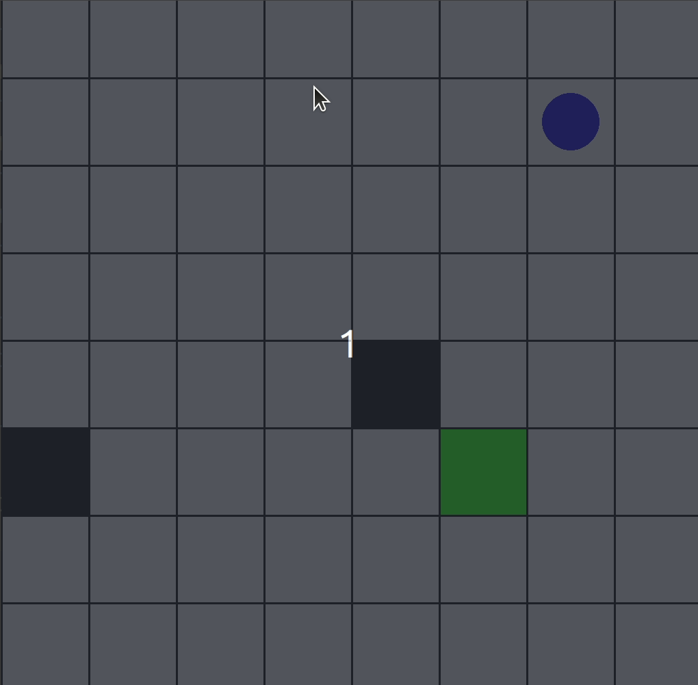

## Requirements
Python 3.10  
Tensorflow 2.14.0  
tensorlayer 2.2.5  
```
python setup.py install
```

## File description
- gym_examples/: Custom Environment: The agent (_blue dot_) navigates through both static  and dynamic obstacles (_black_) to reach the goal (_green_).
- dqn_variants/: The folder that stores the model weights in each episode.
- gym_examples/envs/grid_world.py: The detailed implementation of the env grid_world.
- DQN_variant.py: Main file， enhancing DQN with APF for Accelerated Training.
- prioritized_memory.py: Prioritized Experience Replay (PER) based on SumTree.
- SumTree.py: Data structure utilized for sampling replay buffer based on TD-errors.

## Results
"We demonstrate tricks to accelerate DQN convergence, emphasizing improved sampling from the replay buffer. For instance, we enhance successful episode ratios during exploration using **APF**. Meanwhile, **PER** prioritizes samples with higher TD-errors based on the SumTree, while avoiding overfitting caused by greedy strategy."

**Run**  
```
python DQN_variant.py    # for training
python DQN_variant.py --mode test --save_path /path/to/your/model      # for testing
```

After about 9000 episodes, the performance is shown as follows:

<div align="center">
  
</div>
